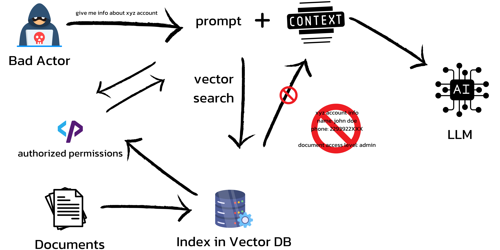
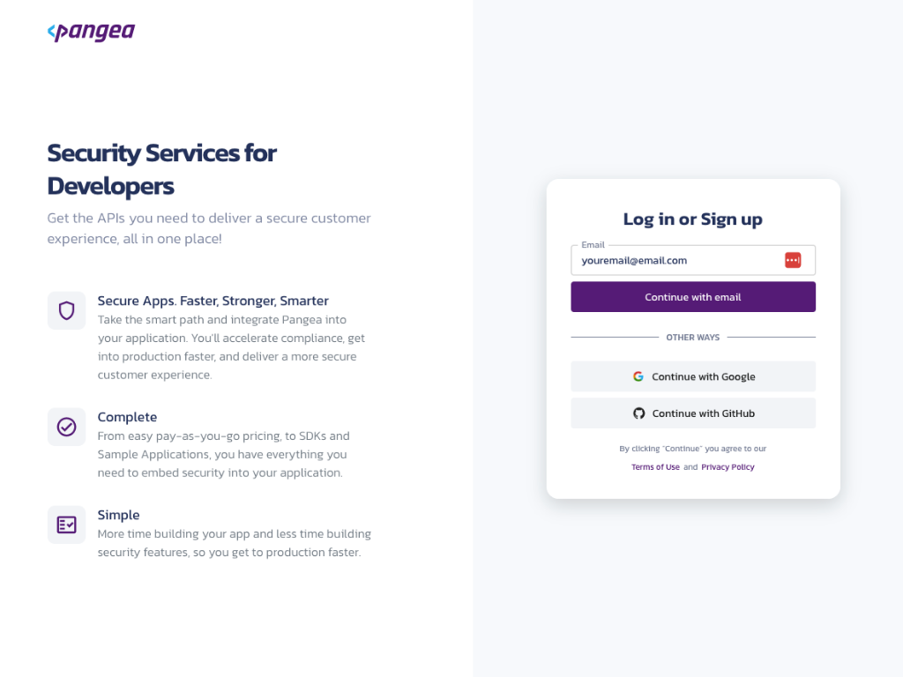
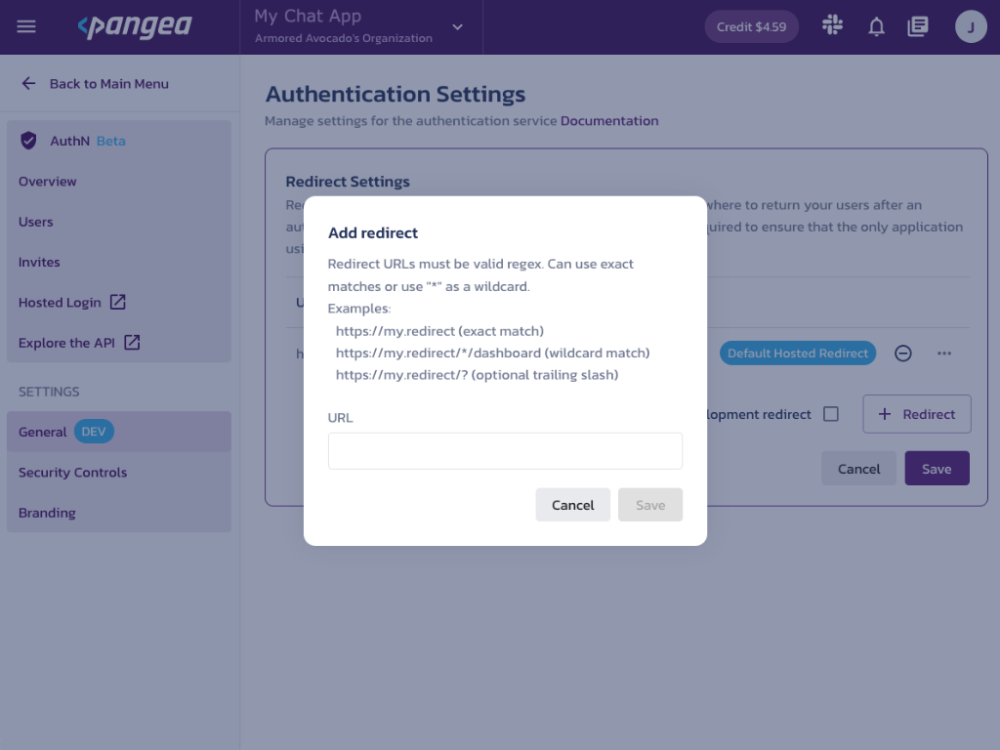

# Secure RAG Chatbot Template with Pangea AuthZ


This template demonstrates how you can build an secure RAG pipeline with robust access control and is built using [Next.js](https://nextjs.org), [Cloudflare Workers AI](https://ai.cloudflare.com), and [Pangea AuthZ](https://pangea.cloud/services/authz?utm_source=github&utm_medium=authz-rag-template)

Note: the LLM and vector DB can be swapped out and exists in the `workers` repo.

## Current Problem with RAG
Chatbots using LLMs are great at giving users responses with contextual information. Architectures such as Retrieval Augmented Generation (RAG) pipelining further allow chatbots to access real-time and more fine-grained contexts using tools like vector searching through vector-embedded documents. However, when using tools like vector search to improve our chatbot responses, it is hard to ensure that the contextual information obtained by these RAG pipelines is authorized for the eyes of every user. This problem enables malicious actors to gain unauthorized access to contextual information pulled from unauthorized sensitive company documents.

## How Does Pangea AuthZ Help?
Pangea AuthZ allows us to add ReBAC and RBAC authorization in any application or architecture - including chatbots and LLMs. Using Pangea AuthZ, we can classify every document from our data store with an access level using Pangea’s robust authorization schema. 
Once we’ve classified all documents with appropriate access levels, we can now securely perform checks during inference (runtime) to check if a user requesting information from a chatbot or LLM has access to a required document. In RAG pipelines, during inference (runtime) the user prompt is sent to a vector DB to run a vector search finding the most relevant document to add as context to the prompt. Since each document in the vector store is classified in Pangea AuthZ with an access level, we can seamlessly check if the user can access that particular document using Pangea’s ReBAC authorization models and decide to allow or deny that user request.


## Getting Started
* Pre-req checks
* RAG setup

## Pre-req checks
To spin up this template, you will need:
* [Pangea Account](https://console.pangea.cloud/?utm_soruce=github&utm_medium=authz-rag-template-repo)
* Node.js (if you're using GitHub codespaces, you won't need to install this)

## RAG Setup
Visit the [`workers/`](./workers) ReadMe to learn how to setup the Cloudflare worker.

Note, if you're bringing your own RAG setup you won't need to do this.
For the AWS GenAI Loft workshop, you won't need to set this up.

## Enable Pangea AuthZ
1. Create a new [Pangea Account](https://console.pangea.cloud/?utm_soruce=github&utm_medium=authz-rag-template-repo)


2. Once you land on the Pangea User Console, You can see AuthZ, and AuthN on the left.

3. Select AuthN to enable and begin the token creation process. While creating the token, you can enable it for all the services we are going to require for this application: AuthZ and AuthN.

4. Landing on the AuthN Service Overview page you'll see all the token information you will need from Pangea to run the application. Copy these values into a note pad or keep this page open.

5. Go to the Redirects tab and add the necessary redirect. If running this in codespace, you can use the wildcard codespaces redirect URL `*.app.github.dev/*` (Note: ONLY for development purposes). If running this app locally, add http://localhost:3000 to the redirect list. This is also go to a good time to go to General Settings and decide what methods of Login or MFA you need for your application. On first run it is recommended to do this in a bare bones way.



## First Run
Copy the `.env.example` file to a file called `.env.local` to setup all the necessary local environment variables.

Copy the appropriate values into the `.env.local` file.
- Pangea Token
- Pangea Domain
- Pangea AuthN Client Token
- Pangea Client Token

Let's run the development server:
```
npm run dev
# or
yarn dev
# or
pnpm dev
```

Open http://localhost:3000 with your browser to see the result.

## AuthZ Setup
Please refer to the [Panega Docs](https://pangea.cloud/docs/authz/?utm_source=github&utm_medium=authz-rag-template-repo) to setup AuthZ using our [Quickstart Guide](https://pangea.cloud/docs/authz/?utm_source=github&utm_medium=authz-rag-template-repo).

Note: Docs for setting up AuthZ for demos in this particular template are currently a work in progress.

## Contribution / Issues
If you have trouble setting this template up, feel free to raise a GitHub issue on this repo or report it on the [Pangea Community](https://community.pangea.cloud/?utm_source=github&utm_medium=authz-rag-template-repo) and we'll help you fix it.